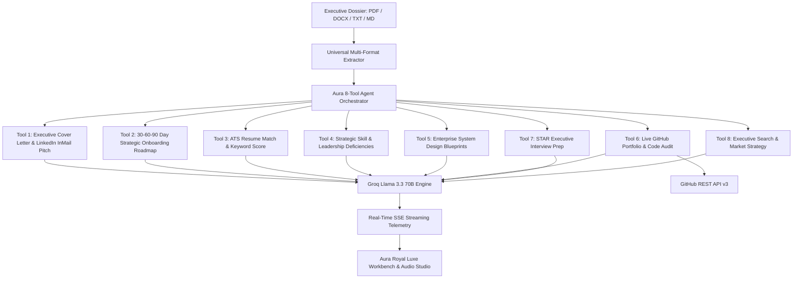

# Aura Career Studio 🌟
### Executive Talent & Leadership Intelligence Suite

[](https://www.python.org/downloads/)
[](https://fastapi.tiangolo.com)
[](https://www.langchain.com)
[](https://groq.com)
[](https://docs.github.com/en/rest)
[](LICENSE)

**Aura Career Studio** is an executive-grade AI Talent Intelligence & Career Strategy Suite designed for Engineering Leaders, Staff/Principal Engineers, and High-Growth Executives. Featuring **8 specialized AI tools**, tailored Cover Letter & LinkedIn InMail generation, 30-60-90 Day Strategic Roadmaps, and browser-native voice speech synthesis.

---

## 🌟 Executive Talent Architecture



---

## 👑 8 Specialized Executive Tools

| Tool | Executive Output |
|---|---|
| ✉️ **Cover Letter & LinkedIn Pitch** | Synthesizes tailored 3-paragraph executive cover letters and high-converting 120-word cold InMail reachouts. |
| 🗓️ **30-60-90 Day Impact Plan** | Crafts a strategic roadmap covering Days 1–30 (Discovery & Quick Wins), Days 31–60 (Ownership), and Days 61–90 (Scale). |
| 📊 **ATS Match & Keyword Audit** | Computes algorithmic match percentage with XYZ bullet rewrites (*Accomplished X, measured by Y, by doing Z*). |
| 🧠 **Leadership Competency Gaps** | Evaluates architectural leadership and cross-functional competencies with an 8-week strategic roadmap. |
| 🛠️ **Enterprise Portfolio Blueprints** | Generates production-grade distributed architectures to bridge technical deficiencies. |
| 🐙 **Live GitHub Portfolio Mining** | Queries GitHub REST API to assess public repositories, documentation quality, and commit consistency. |
| 🎙️ **Executive STAR Simulation** | Simulates system architecture scenarios, leadership behavioral questions, and reverse-interview inquiries. |
| 🎯 **Executive Search Strategy** | Recommends executive search firms, tier-1 tech companies, and warm 30-day networking strategies. |

---

## 🚀 Quick Start

```bash
git clone https://github.com/rishithaburra22-sys/Aura-Career-Studio.git
cd Aura-Career-Studio

# Install dependencies
pip install -r requirements.txt

# Run server
python app.py
```
Open **[http://localhost:8000](http://localhost:8000)**.

---

## 🧪 Testing

```bash
pytest tests/ -v
# ========================= 7 passed in 0.49s =========================
```

---

## 📄 License

Distributed under the **MIT License**.
