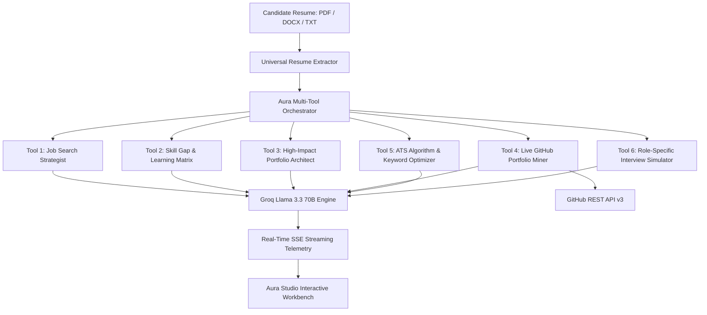

# Aura Career Studio 🚀
### Enterprise AI Talent Intelligence & Career Strategy Suite

[](https://www.python.org/downloads/)
[](https://fastapi.tiangolo.com)
[](https://www.langchain.com)
[](https://groq.com)
[](https://docs.github.com/en/rest)
[](LICENSE)

**Aura Career Studio** is a next-generation AI Career Intelligence Platform engineered to bridge the gap between engineering talent and hiring teams. Combining multi-agent orchestration, live GitHub repository mining, algorithmic ATS resume scoring, and real-time Server-Sent Events (SSE) streaming, Aura transforms raw resumes into high-impact career roadmaps and portfolio blueprints.

---

## 🌟 Core Architecture & Capabilities



---

## ✨ Key Features

| Module | Description |
|---|---|
| 🎯 **Strategic Job Search** | Identifies tier-1/tier-2 tech companies actively hiring, specialized niche job boards, and 30-day networking roadmaps. |
| 📊 **ATS Match & Keyword Optimizer** | Computes algorithmic keyword density, matched vs. missing skill tags, and rewrites bullets with the XYZ formula (*Accomplished X, as measured by Y, by doing Z*). |
| 🧠 **Deep Skill Gap Analysis** | Pinpoints architectural and distributed systems deficiencies with realistic multi-week learning roadmaps. |
| 🛠️ **Portfolio Project Architect** | Generates production-grade system design project blueprints tailored specifically to prove missing skills. |
| 🐙 **Live GitHub Portfolio Mining** | Connects to GitHub REST API to audit star counts, languages, commit cadence, and repository documentation health. |
| 🎙️ **Interview Prep & Question Simulator** | Simulates role-specific system design problems and behavioral questions structured with STAR methodology guidance. |
| ⚡ **Real-Time SSE Streaming** | Live stage-by-stage telemetry updates directly to the browser with zero UI lag. |
| 🔊 **Voice Speech Synthesis** | Built-in browser-native Read Aloud audio playback for on-the-go review. |
| 📦 **Universal File Parsing** | Supports PDF, Microsoft Word (`.docx`), Markdown, Text, and JSON schemas. |
| 📑 **Export Studio** | 1-Click download of complete intelligence briefs as formatted Markdown (`.md`) or structured JSON (`.json`). |

---

## 🚀 Quick Start (Local Setup)

### 1. Prerequisites
- **Python 3.9+** (Python 3.11 recommended)
- **Groq API Key** ([Get your free API key at console.groq.com](https://console.groq.com/keys))
- **GitHub Personal Access Token** *(Optional, for higher rate limits)*

### 2. Clone and Install
```bash
git clone https://github.com/rishithaburra22-sys/Aura-Career-Studio.git
cd Aura-Career-Studio

# Create and activate virtual environment
python3 -m venv venv
source venv/bin/activate  # On Windows: venv\Scripts\activate

# Install dependencies
pip install -r requirements.txt
```

### 3. Configure Environment Variables
Create a `.env` file in the root directory:
```env
GROQ_API_KEY=gsk_your_groq_api_key_here
GITHUB_TOKEN=ghp_your_github_personal_access_token_here  # Optional
GROQ_MODEL=llama-3.3-70b-versatile
```

### 4. Run Development Server
```bash
uvicorn app:app --host 0.0.0.0 --port 8000 --reload
```
Open **[http://localhost:8000](http://localhost:8000)** in your browser.

---

## 📡 API Reference & cURL Examples

### 1. System Health Check
```bash
curl -X GET http://localhost:8000/health
```

### 2. Fetch Sample Profile
```bash
curl -X GET http://localhost:8000/sample-resume/fullstack
```

### 3. Analyze Career Profile (Multipart / Form-Data)
```bash
curl -X POST "http://localhost:8000/analyze" \
  -F "resume_file=@resume.pdf" \
  -F "target_role=Senior Full-Stack Engineer" \
  -F "github_username=torvalds"
```

### 4. Real-Time SSE Stream Endpoint
```bash
curl -N -X POST "http://localhost:8000/analyze-stream" \
  -H "Content-Type: application/json" \
  -d '{
    "resume_text": "Experienced Python and React developer with AWS knowledge...",
    "target_role": "Staff AI / ML Engineer",
    "github_username": "karpathy"
  }'
```

---

## 🧪 Testing

Run the automated test suite:
```bash
pytest tests/ -v
```

---

## ☁️ Deployment on Render

This repository includes a ready-to-deploy `render.yaml` blueprint:

1. Connect your GitHub repository to [Render](https://render.com).
2. Click **New +** → **Blueprint**.
3. Select `Aura-Career-Studio`.
4. Add your `GROQ_API_KEY` in the Environment Variables dashboard.
5. Deploy!

---

## 📄 License

Distributed under the **MIT License**. See `LICENSE` for details.
